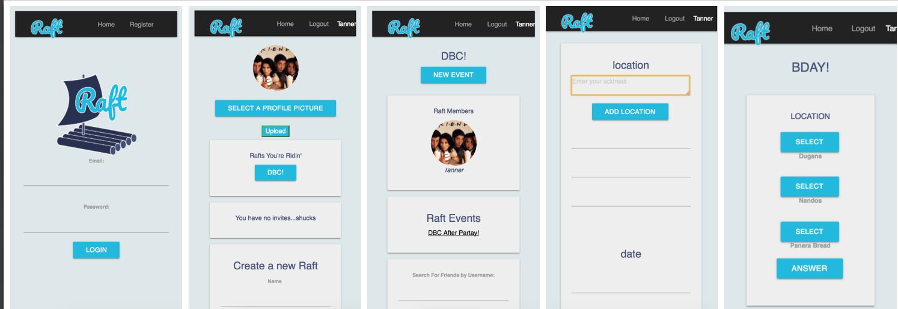

# Raft
**Project Description**

This is our final group project for Dev Bootcamp. Raft is a Ruby on Rails web app that helps groups of friends plan events and stay accountable. 

**Tech Stack**
- Google Maps API
- Dwolla API
- Rails 
- Postgresql
- Heroku

**Screenshots**

*Deployed at raft2k17.heroku.com*
